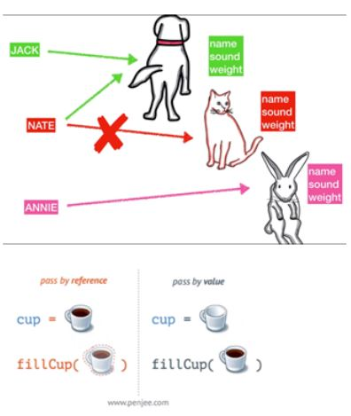

객체 지향 프로그래밍 (Object-Oriented Programing)
====================================================

링크출처
[위키피디아]https://ko.wikipedia.org/wiki/%EA%B0%9D%EC%B2%B4_%EC%A7%80%ED%96%A5_%ED%94%84%EB%A1%9C%EA%B7%B8%EB%9E%98%EB%B0%8D

[생활코딩]https://opentutorials.org/course/743/6553

[마리오]https://see-ro-e.tistory.com/108

[유투브]https://www.youtube.com/watch?v=GwL5uUP7F1Y

# 객체 지향 프로그래밍(object-oriented programming)이란

: 컴퓨터 프로그래밍의 패러다임 중 하나로
<-> __절차 지향 프로그래밍__ : 각종 변수와 구조체 등을 모듈화된 함수 등을 사용하여 특정 절차를 거쳐 프로그램을 구성. 프로그램이 커지면 이 구성이 힘듬.

- 객체 지향 프로그래밍은 컴퓨터 프로그램을 여러 개의 독립된 단위, 즉 객체 들의 모임으로 파악하고자 하는 것.
- 로직을 상태(state)와 행위(behave)로 이루어진 객체로 만들고 이를 조립되어 하나의 프로그램을 만든다. 
- 각각의 객체는 메시지를 주고 받고 데이터를 처리할 수 있다.
- 객체 지향 프로그래밍은 프로그램을 유연하고 변경이 용이하게 만들어 대규모 소프트웨어 개발에 용이
- 더 쉽고 편하며 코드 분석이 직관적.

## 기본 구성 요소
클래스, 객체, 메서드, 메시지 

1. 클래스 (Class) : 같은 종류(또는 문제 해결을 위한)의 집단에 속하는 속성과 행위를 정의한 것.
    - 객체 지향 프로그램의 기본적인 사용자 정의 데이터형. 
    - 클래스는 다른 클래스 또는 외부 요소와 독립적.
2. 객체 (object) : 클래스의 인스턴스(실제로 메모리상에 할당된 것).
    - 객체는 자신의 고유 속성을 가지며 클래스에서 정의한 행위를 수행. 객체의 행위는 클래스에 정의된 행위에 대한 정의를 공유해 메모리가 절약됨
3. 메서드(method), 메시지(Message) : 클래스로부터 생성된 객체를 사용하는 방법, 객체에 명령을 내리는 메세지. 
    - 메서드 : 클래스로부터 생성된 객체를 사용(명령)하는 방법. 한 객체의 서브루틴 형태로 객체의 속성을 조작하는 데 사용.
    - 메세지 : 객체간의 통신은 메세지를 통해 이루어짐.

## 특징

1. __자료추상화__ : 복잡함 속에서 필요한 관점만을 추출하는 행위
    - 불필요한 정보는 숨기고 중요한 정보만을 표현해 프로그램을 간단히함. 
    - 추상 자료형 : 자료 추상화를 통해 정의된 자료형, 자료 표현과 자료형 연산을 캡슐화한 것. 접근제어를 통해 자료형의 정보를 은닉 가능.

추상 자료형 : 클래스, 추상 자료형의 인스턴스 : 객체, 추상 자료형에 정의된 연산 : 메소드, 메소드의 호출 : 생성자

2. __상속__ : 새로운 클래스가 기존의 클래스의 자료와 연산을 이용할 수 있게 하는 기능. 
    - 하위 클래스를 이용해 목적에 맞춰 클래스를 수정할 수 있고, 클래스 간의 종속 관계를 형성해서 객체를 조직화 가능.

+ 상속을 받는 새로운 클래스 : 부클래스, 파생 클래스, 하위 클래스, 자식 클래스.
+ 상속을 하는 기존의 클래스 :  기반 클래스, 상위 클래스, 부모 클래스

3. __다중 상속__ : 다중 상속은 클래스가 2개 이상의 클래스로부터 상속받을 수 있게 하는 기능. 
    - 클래스들의 기능이 동시에 필요할 때 이용. 
    - 단점... 클래스의 상속 관계에 혼란, 프로그래밍 언어에 따라 사용 가능 유무가 다름 (JAVA는 없음)

4. __다형성 개념__ : 어떤 한 요소에 여러 개념을 넣어 놓는 것. 
    - 일반적으로 오버라이딩이나 오버로딩을 의미
    - 오버라이딩 : 같은 이름의 메소드가 여러 클래스에서 다른 기능을 하는 것
    - 오버로딩 : 같은 이름의 메소드가 인자의 개수나 자료형에 따라 다른 기능을 하는 것

5. __동적 바인딩__ : 실행 시간 중에 일어나거나 실행 과정에서 변경될 수 있는 바인딩. 
    - 컴파일 시간에 완료되어 변화하지 않는 정적 바인딩과 대비되는 개념. 
    - 동적 바인딩은 프로그램의 한 개체나 기호를 실행 과정에 여러 속성이나 연산에 바인딩함으로써 다형성 개념을 실현.

## 장점
1. 행동하는 주체와 행동이 묶여 누가 무엇을 하는지 명확
2. 디버깅이 쉬움
  : - 어디서 잘못 되었는지 명확해 캐릭터에서 잘못되면 캐릭터 클래스와 관련된 것만 고침.
  - 캐릭터의 요구사항이 변경되면 캐릭터 클래스만 수정.
    
3. 똑같은 기능을 하는 클래스가 필요하다면 재사용이 쉬움

## 지향점
1. __부품화__ : 객체를 하나의 부품으로써 이용할 수 있게 함.
- 메소드 프로그램 안에서 중복적으로 사용되는 것을 메소드로 만들어 사용해 코드의 양을 줄이고 기능이 분류되어 코드의 디버깅도 쉽다.
2. __은닉화, 캡슐화__ : 객체가 가지고 있는 메소드(사용법)만 알면 사용가능.
3. __인터페이스__ : 부품과 부품이 서로 규격이 표준화 되어있기 때문에 서로 연결할 수 있듯이 장치와 장치를 연결하는 연결점

## class와 object의 활용

### new로 만든 object1,2,3
- 메모리 상에 class가 instance된 object 3개 존재 
- 실제 세계에 존재하는 object 3개라면 변수도 그 수만큼 존재해서 object를 가리켜 줘야함. (V1, V2, V3)
(O1 - V1, O2 - V2, O3 - V3)
- 가리키는 변수가 없다면 object는 길을 잃고 가비지가 됨.
__변수는 object를 가리키는 그림자__

### object를 가리키는 변수를 Nate = Jack을 통해 Nate가 Jack으로 바뀐 후.
Nate의 속성을 바꾸면 (이 전에는 남아있던 Jack은 변경되지 않고 Nate가 변경되었는데)  Nate가 가리키는 object가 Jack이 가리키는 object로 되어서 Nate를 변경하는 것이 Jack이 가리키는 object를 변경하는 것과 같아짐.

class Animal은 new를 이용해 아무것도 존재하지 않는 공간에 새로운 Animal이 생성됨. 이를 부등호를 통해 새로 탄생된 Animal(object)l에 Jack이라는 그림자를 붙여줌.
따라서 Nate = Jack 을 하면 Nate의 값은 Jack이 가지고 있는 화살표가 되기 때문에 두개의 변수가 하나의 object를 가리키는 것이 됨.

##   Call by reference
: 변수는 진짜 object가 아니라 가리키는 그림자
object는 실제 존재하지만 이름이 없고 변수로 지정한 화살표로 가리켜짐
<--> __call by value__

### '가져와서 쓴다'는 개념
: 변수는 진짜 object가 아니라 실제 존재하는 object로 연결해서 쓴다.
